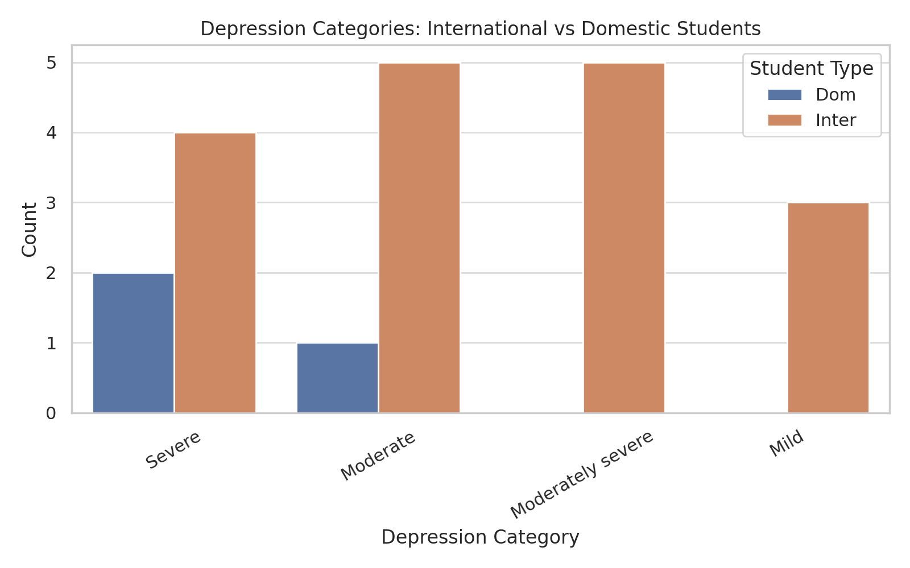
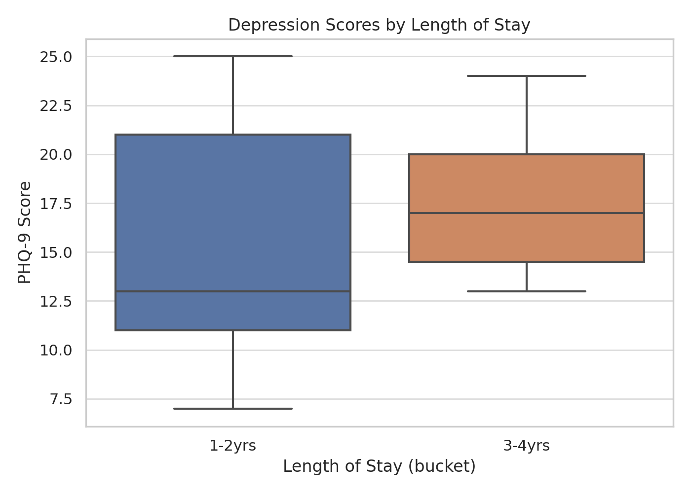
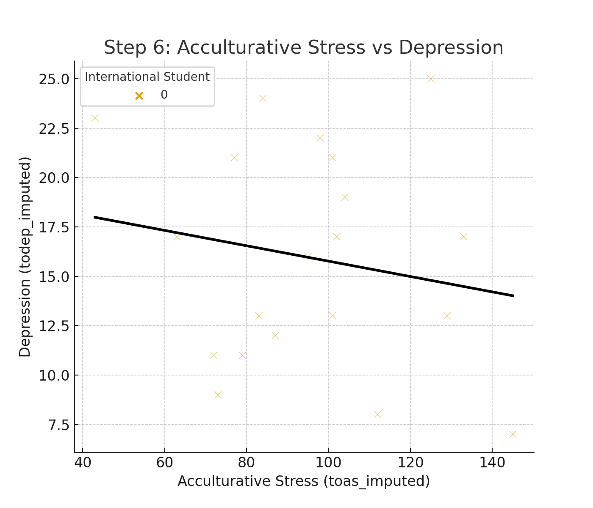

# 🧠 Students' Mental Health Analysis – International vs Domestic  

_Exploring mental health risk factors among international vs. domestic students, focusing on depression, connectedness, and acculturative stress._  

---

## 📌 Table of Contents
- <a href="#overview">Overview</a>
- <a href="#business-problem">Business Problem</a>
- <a href="#dataset">Dataset</a>
- <a href="#tools--technologies">Tools & Technologies</a>
- <a href="#project-structure">Project Structure</a>
- <a href="#data-cleaning--preparation">Data Cleaning & Preparation</a>
- <a href="#exploratory-data-analysis-eda">Exploratory Data Analysis (EDA)</a>
- <a href="#research-questions--key-findings">Research Questions & Key Findings</a>
- <a href="#dashboard">Dashboard</a>
- <a href="#how-to-run-this-project">How to Run This Project</a>
- <a href="#final-recommendations">Final Recommendations</a>
- <a href="#author--contact">Author & Contact</a>

---

<h2><a class="anchor" id="overview"></a>Overview</h2>

This project analyzes **students’ mental health data** from a Japanese international university survey (2018).  
It explores whether **international students face higher depression risks** and how **connectedness, acculturative stress, and length of stay** influence mental health outcomes.  

---

<h2><a class="anchor" id="business-problem"></a>Business Problem</h2>

Universities must support international student well-being. This project addresses:  
- Do international students show higher depression rates?  
- Can social connectedness buffer mental health risks?  
- Does length of stay reduce depression?  
- How does acculturative stress impact mental health?  

---

<h2><a class="anchor" id="dataset"></a>Dataset</h2>

- **286 rows** of survey responses  
- **Key fields**: depression (PHQ-9), connectedness (SCS), acculturative stress (ASISS), demographics, language proficiency, stay duration  

---

<h2><a class="anchor" id="tools--technologies"></a>Tools & Technologies</h2>

- SQL (PostgreSQL)  
- Python (Pandas, Matplotlib, Seaborn, SciPy)  
- GitHub  

---

<h2><a class="anchor" id="project-structure"></a>Project Structure</h2>

students-mental-health-analysis/
│
├── README.md
├── data/
│ └── students_mental_health.csv
│
├── notebooks/
│ ├── mental_health_eda.ipynb
│ └── regression_analysis.ipynb
│
├── images/
│ ├── depression_international_vs_domestic.png
│ ├── depression_distribution.png
│ ├── connectedness_vs_depression.png
│ ├── length_of_stay.png
│ └── stress_vs_depression.png

---

<h2><a class="anchor" id="data-cleaning--preparation"></a>Data Cleaning & Preparation</h2>

- Standardized categories (domestic vs. international, language levels)  
- Converted text-based scores (Low, Average, High) → numeric values  
- Removed missing/invalid responses  

---

<h2><a class="anchor" id="exploratory-data-analysis-eda"></a>Exploratory Data Analysis (EDA)</h2>

**Key findings from EDA:**
- International students show slightly higher depression scores.  
- Depression distribution: Most students fall into **Mild to Moderate** categories.  
- Higher social connectedness → lower depression.  
- First-year students show higher depression scores.  
- Acculturative stress strongly correlates with depression.  

---

<h2><a class="anchor" id="research-questions--key-findings"></a>Research Questions & Key Findings</h2>

1. **International vs Domestic Depression**: International students report higher average depression.  
2. **Role of Connectedness**: Strong protective factor – higher connectedness = lower depression.  
3. **Impact of Stress**: Higher acculturative stress = higher depression risk.  
4. **Effect of Stay Length**: First year is most vulnerable; longer stays reduce depression.  

---
<h2><a class="anchor" id="dashboard"></a>Dashboard</h2>

### 🌍 Depression Levels: International vs Domestic  
  

### ⏳ Effect of Length of Stay on Depression  
  

### 😰 Acculturative Stress vs Depression  
  

## 🚀 How to Run This Project
1. Clone the repository:
```bash
git clone https://github.com/yourusername/students-mental-health-analysis.git
```
2. Place dataset in `/data/`.

3. Run notebooks:
- `notebooks/mental_health_eda.ipynb`
- `notebooks/regression_analysis.ipynb`

---

## 📌 Final Recommendations
- Strengthen community-building programs for international students.
- Offer stress management workshops early in study programs.
- Prioritize first-year support systems.
- Continuously monitor and evaluate student well-being.

---

## 👤 Author & Contact
**Farhat-Ul-Ain**  
📧 Email: farhatulainakmal@gmail.com  
🔗 [LinkedIn](https://www.linkedin.com/in/farhat-ul-ain-akmall-6a1b89374/)

